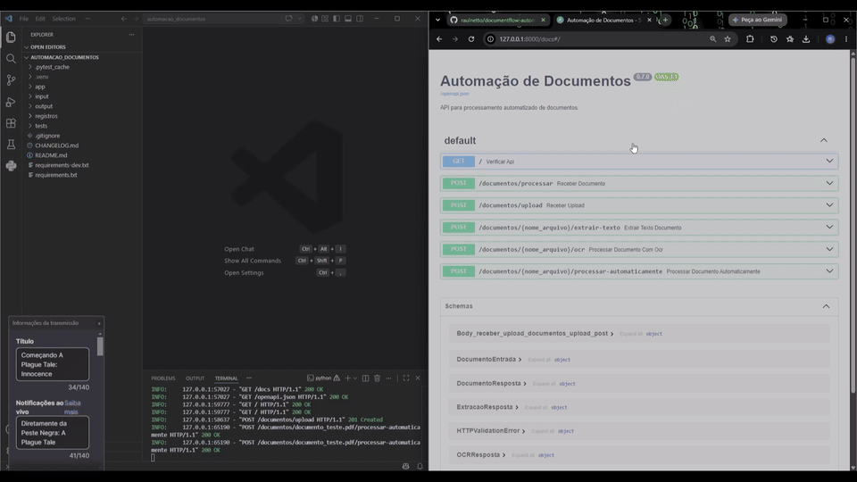

# DocumentFlow Automation

[](https://github.com/raulnetto/documentflow-automation/actions/workflows/tests.yml)

Document processing and automation pipeline built with **Python and FastAPI**.

DocumentFlow receives files, automatically decides between native text extraction and OCR, persists processing history, exposes an HTTP API and webhook integration, and can be orchestrated through **n8n**.

### Engineering highlights

- automatic routing between **PyMuPDF** and **Tesseract OCR**;
- layered architecture with **FastAPI → service → repository → SQLite**;
- structured processing history with UUID-based traceability;
- webhook integration for external automation;
- reproducible n8n workflow;
- automated tests with **pytest**;
- continuous integration with **GitHub Actions**.

**Current version:** `v0.10.0`  
**Automated tests:** `19 passed`

## Demonstração



> O GIF apresenta o fluxo principal da API. A integração com N8N está documentada em [`n8n/README.md`](n8n/README.md) e pode ser reproduzida com o workflow exportado.

## Estado atual

Versão atual: **v0.10.0**

A aplicação já consegue:

- receber metadados e uploads reais;
- validar extensões e arquivos vazios;
- armazenar documentos em `input/`;
- extrair texto de PDFs digitais com PyMuPDF;
- executar OCR em imagens e PDFs escaneados com Tesseract;
- escolher automaticamente entre extração digital e OCR;
- gerar arquivos TXT em `output/`;
- registrar sucessos e falhas em JSON;
- persistir o histórico de processamentos em SQLite;
- manter JSON e SQLite em paralelo durante a transição;
- identificar cada processamento com UUID;
- registrar data, hora, mecanismo, páginas, caracteres e mensagens de erro;
- preservar `origem` e `id_fluxo`;
- consultar o histórico completo de processamentos;
- consultar um processamento específico por UUID;
- retornar estatísticas agregadas de sucessos, erros e mecanismos utilizados;
- responder com códigos HTTP adequados;
- disponibilizar documentação OpenAPI e Swagger;
- receber solicitações externas por webhook;
- ser acionada por um workflow real do N8N;
- separar automaticamente os caminhos de sucesso e erro no N8N;
- isolar o banco de dados real durante os testes automatizados;
- validar os principais comportamentos com **19 testes automatizados**;
- executar a suíte automaticamente com GitHub Actions em pushes e pull requests para `main`.

## Tecnologias

- Python
- FastAPI
- Pydantic
- Uvicorn
- SQLite
- `sqlite3`
- PyMuPDF
- pytesseract
- Pillow
- Tesseract OCR
- pathlib
- UUID
- JSON
- OpenAPI / Swagger
- pytest
- TestClient
- monkeypatch
- tmp_path
- GitHub Actions
- N8N
- Node.js e npm
- Git e GitHub

## Arquitetura atual

```text
Usuário ou automação
        │
        ▼
FastAPI / Webhook
        │
        ▼
Processador automático
   ┌────┴────┐
   ▼         ▼
PyMuPDF   Tesseract
   └────┬────┘
        ▼
    arquivo TXT
        │
        ▼
criar_registro_processamento()
   ┌────┴──────────────┐
   ▼                   ▼
JSON               Repository
                       │
                       ▼
                     SQLite
```

Consulta do histórico:

```text
Cliente / Swagger
      │
      ▼
FastAPI
      │
      ▼
Service de histórico
      │
      ▼
Repository
      │
      ▼
SQLite
```

Com N8N:

```text
Manual Trigger
→ Configurar Processamento
→ Chamar DocumentFlow
→ Validar Resposta
   ├── statusCode 200 → Resultado - Sucesso
   └── outro código  → Resultado - Erro
```

## Fluxo principal da API

```text
arquivo enviado
→ FastAPI recebe
→ extensão é validada
→ arquivo é salvo em input/
→ processador identifica o tipo
→ PDF digital usa PyMuPDF
→ PDF sem texto digital usa Tesseract OCR
→ imagem usa Tesseract OCR
→ TXT é salvo em output/
→ resultado é registrado em JSON
→ o mesmo evento é persistido no SQLite
→ API devolve status, mecanismo e referência do registro
```

## Endpoints principais

### Processamento automático

```text
POST /documentos/{nome_arquivo}/processar-automaticamente
```

### Webhook para automações externas

```text
POST /webhooks/processar-documento
```

Exemplo de entrada:

```json
{
  "nome_arquivo": "documento_demo.pdf",
  "origem": "n8n",
  "id_fluxo": "workflow-001"
}
```

Exemplo de resposta de sucesso:

```json
{
  "status": "processamento_concluido",
  "origem": "n8n",
  "id_fluxo": "workflow-001",
  "arquivo_origem": "documento_demo.pdf",
  "arquivo_texto": "documento_demo_ocr.txt",
  "quantidade_paginas": 1,
  "quantidade_caracteres": 1555,
  "mecanismo": "tesseract",
  "id_registro": "uuid-gerado",
  "caminho_registro": "registros/uuid-gerado.json"
}
```

O webhook trata:

- `200` — processamento concluído;
- `400` — conteúdo inválido;
- `404` — arquivo inexistente;
- `503` — mecanismo externo indisponível.

### Histórico de processamentos

```text
GET /processamentos
```

Retorna o histórico completo, ordenado pelos registros persistidos no SQLite.

```text
GET /processamentos/{identificador}
```

Retorna um processamento específico pelo UUID. Um identificador inexistente retorna `404`.

```text
GET /processamentos/resumo
```

Retorna estatísticas agregadas do histórico.

Exemplo:

```json
{
  "total": 2,
  "sucessos": 2,
  "erros": 0,
  "por_mecanismo": {
    "pymupdf": 2
  }
}
```

## Integração com N8N

A v0.9 adicionou um workflow real e exportável, preservado na v0.10.

Arquivos:

```text
n8n/
├── README.md
└── workflows/
    └── documentflow-processamento.json
```

O workflow:

1. inicia manualmente;
2. define `nome_arquivo`, `origem` e `id_fluxo`;
3. envia uma requisição HTTP para o webhook;
4. recebe corpo, cabeçalhos e código HTTP;
5. mantém respostas de erro no fluxo com `Never Error`;
6. verifica se `statusCode == 200`;
7. produz uma saída padronizada de sucesso ou erro.

Documentação detalhada:

```text
n8n/README.md
```

## Persistência e histórico

Cada processamento continua gerando um arquivo JSON em `registros/` e passa também a ser persistido no SQLite.

Campos persistidos:

- `id`;
- `data_hora`;
- `arquivo_origem`;
- `origem`;
- `id_fluxo`;
- `status`;
- `mecanismo`;
- `arquivo_saida`;
- `quantidade_paginas`;
- `quantidade_caracteres`;
- `mensagem_erro`.

O UUID é utilizado como chave primária da tabela `processamentos`.

O banco local fica em:

```text
dados/documentflow.db
```

O arquivo `.db` é ignorado pelo Git. Apenas `dados/.gitkeep` é versionado.

A persistência JSON foi mantida durante a transição para preservar compatibilidade e auditoria.

## Camadas de acesso ao banco

A v0.10 separa responsabilidades entre as camadas:

```text
rota FastAPI
→ service
→ repository
→ SQLite
```

Responsabilidades:

- **rota:** contrato HTTP, códigos de resposta e integração com FastAPI;
- **service:** transforma e valida os dados de domínio;
- **repository:** concentra `INSERT`, `SELECT` e consultas agregadas;
- **SQLite:** persiste o histórico localmente.

O repository utiliza consultas parametrizadas para inserir e buscar dados.

## Testes automatizados e CI

A v0.10 mantém **19 testes automatizados**.

### API

- rota raiz retorna `200`;
- versão anunciada é `0.10.0`;
- processamento automático retorna `200`, `400`, `404` e `503`;
- webhook retorna `200`, `400`, `404` e `503`;
- webhook preserva `origem` e `id_fluxo`;
- histórico completo retorna `200`;
- consulta por UUID retorna `200`;
- UUID inexistente retorna `404`;
- resumo agregado retorna `200`.

### Processador automático

- PDF digital usa PyMuPDF;
- PDF sem texto digital faz fallback para OCR;
- imagem usa OCR diretamente;
- arquivo inexistente gera `FileNotFoundError`;
- extensão não suportada gera `ValueError`.

### Registro e banco

- JSON é criado corretamente;
- UUID, status e campos principais são validados;
- testes usam diretórios temporários;
- o SQLite dos testes é redirecionado para um banco temporário;
- o banco local real não é contaminado pela suíte.

Executar:

```powershell
python -m pytest -v
```

Resultado validado:

```text
19 passed
```

Existe atualmente um aviso de depreciação vindo da integração entre FastAPI, Starlette TestClient e httpx. O aviso não invalida a suíte.

### GitHub Actions

O repositório possui integração contínua em:

```text
.github/workflows/tests.yml
```

O workflow:

- executa em pull requests para `main`;
- executa em pushes para `main`;
- prepara um ambiente Ubuntu limpo;
- instala Python e as dependências de desenvolvimento;
- executa `python -m pytest -v`;
- expõe o resultado publicamente pelo badge no topo deste README.

## Instalação

### Dependências da aplicação

```powershell
python -m pip install -r requirements.txt
```

### Dependências de desenvolvimento

```powershell
python -m pip install -r requirements-dev.txt
```

### Dependência externa de OCR

O Tesseract OCR precisa estar instalado e configurado na máquina.

### N8N

O workflow foi executado localmente com Node.js, npm e:

```powershell
npx n8n
```

## Como executar

### 1. Ativar o ambiente Python

```powershell
.\.venv\Scripts\Activate.ps1
```

### 2. Iniciar a API

```powershell
python -m uvicorn app.main:app --reload
```

Swagger:

```text
http://127.0.0.1:8000/docs
```

Na primeira utilização do banco, a estrutura necessária é criada automaticamente pela aplicação.

### 3. Iniciar o N8N em outro terminal

```powershell
npx n8n
```

Editor:

```text
http://localhost:5678
```

### 4. Importar o workflow

```text
Import from File
→ n8n/workflows/documentflow-processamento.json
```

### 5. Preparar um arquivo neutro de demonstração

```text
input/documento_demo.pdf
```

A pasta `input/` não é versionada.

## Estrutura principal

```text
app/
├── database.py
├── exceptions.py
├── main.py
├── models.py
├── repositories/
│   ├── __init__.py
│   └── processamento_repository.py
└── services/
    ├── armazenamento.py
    ├── extrator_ocr.py
    ├── extrator_pdf.py
    ├── historico_processamentos.py
    ├── processador.py
    ├── processador_automatico.py
    └── registro_processamento.py

tests/
├── conftest.py
├── test_api.py
├── test_processador_automatico.py
└── test_registro_processamento.py

dados/
└── .gitkeep

n8n/
├── README.md
└── workflows/
    └── documentflow-processamento.json

docs/
└── assets/
    └── documentflow-demo.gif

input/
output/
registros/
README.md
CHANGELOG.md
requirements.txt
requirements-dev.txt
.gitignore
```

## Privacidade

Não são versionados:

- documentos de entrada;
- arquivos TXT gerados;
- registros JSON produzidos;
- banco SQLite local;
- documentos pessoais;
- senhas, tokens ou credenciais.

O endereço `127.0.0.1` representa apenas o próprio computador e não expõe endereço residencial ou IP público.

## Limitações atuais

- o workflow do N8N ainda usa gatilho manual;
- o documento precisa existir previamente em `input/`;
- API e N8N precisam estar rodando localmente;
- não há upload binário direto pelo N8N;
- o banco atual é SQLite local;
- ainda não há paginação ou filtros avançados no histórico;
- não há autenticação;
- não há idempotência ou política de repetição;
- não há Docker;
- não há deploy público;
- não há dashboard;
- o caminho do Tesseract ainda depende da configuração local.

## Próximos passos

- externalizar configurações com variáveis de ambiente;
- adicionar autenticação por API key;
- avaliar filtros e paginação do histórico;
- containerizar a aplicação com Docker;
- preparar ambiente de deploy;
- evoluir observabilidade e monitoramento;
- preparar a base para relatórios e dashboard.
